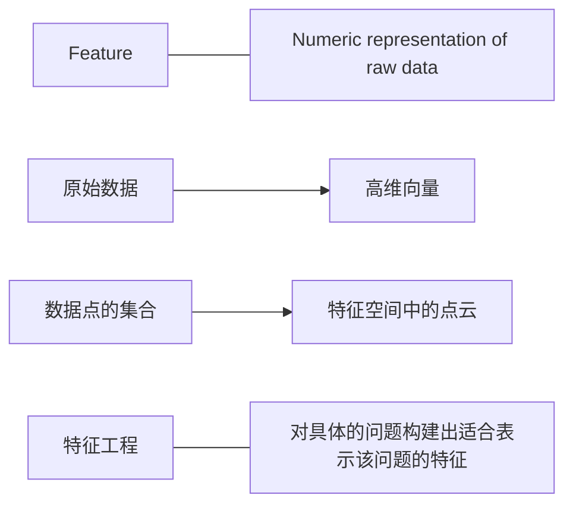
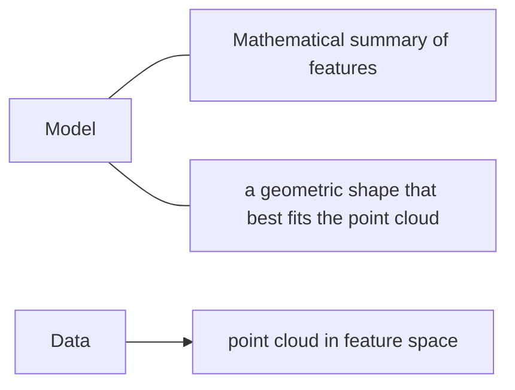

# 导读

参考 [PPT](../papers/dominodatasciencepopupseattlealicezhengunderstanding-feature-space-151013124607-lva1-app6891.pdf) 与 [简介](https://www.slideshare.net/dominodatalab/data-science-popup-seattle-understanding-feature-space-in-machine-learning).

## 机器学习算法的流程 (pipeline)

应用机器学习算法的流程大致可以分为:

- 收集数据
- 数据处理，提取特征
- 训练模型
- 模型部署
- 模型的应用及反馈

## 机器学习的关键问题

在机器学习中主要有如下的三个关键问题：

- 特征 = 对原始数据的数值表示
- 模型 = 对特征的数学总结
- 成功的应用 = 对给定的数据和任务选择合适的模型和特征

## 机器学习中的特征空间

数学可以粗略地分为两类, 一是代数, 即将问题转换成许多组的数和变量; 另一个则是几何, 即通过图形的方法理解身边的事物.

## 模型

模型是对特征的一种数学的概括, 是指对特征进行的一种数学的表达. 对于分类模型, 以二分类为例, 主要是要找到一个分隔超平面将特征空间分成两个类, 如下图所示:

对于聚类模型, 通过对特征空间中的特征实施某种相似性的度量, 将相似的特征聚在一起, 便达到了聚类的目的, 如下图所示:

对于回归问题, 需要找到最合适的方式去拟合样本空间中的样本点, 如下图所示:

